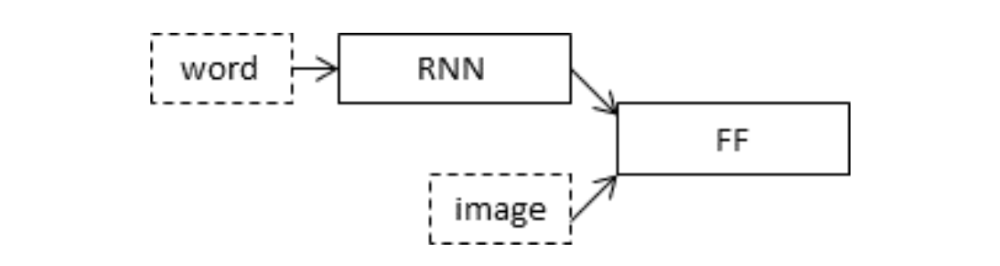
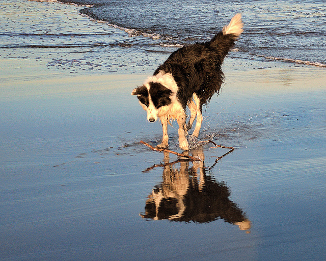

# Image Captioning

Caption generation is a challenging artificial intelligence problem where a textual description must be generated for a given photograph.

It requires both methods from computer vision to understand the content of the image and a language model from the field of natural language processing to turn the understanding of the image into words in the right order. Recently, deep learning methods have achieved state-of-the-art results on examples of this problem.

Deep learning methods have demonstrated state-of-the-art results on caption generation problems. What is most impressive about these methods is a single end-to-end model can be defined to predict a caption, given a photo, instead of requiring sophisticated data preparation or a pipeline of specifically designed models.

## Notebook File Overview
This notebook is divided into 6 parts; they are:

1. Photo and Caption Dataset
2. Prepare Photo Data
3. Prepare Text Data
4. Develop Deep Learning Model
5. Train With Progressive Loading (NEW)
6. Evaluate Model
7. Generate New Captions

## 	Python Environment
This tutorial assumes you have a Python SciPy environment installed, ideally with Python 3.
You must have Keras (2.1.5 or higher) installed with either the TensorFlow or Theano backend.
The tutorial also assumes you have scikit-learn, Pandas, NumPy, and Matplotlib installed.

## Dataset
[Flickr8k Dataset](http://nlp.cs.illinois.edu/HockenmaierGroup/Framing_Image_Description/KCCA.html) is used.
You can use the link below to request the dataset:
- [Dataset Request Form](https://illinois.edu/fb/sec/1713398)

## Defining the Model
We will define a deep learning based on the “merge-model” described by Marc Tanti, et al. in their 2017 papers:

- [Where to put the Image in an Image Caption Generator, 2017.](https://arxiv.org/abs/1703.09137)
- [What is the Role of Recurrent Neural Networks (RNNs) in an Image Caption Generator?, 2017.](https://arxiv.org/abs/1703.09137)

A nice schematic of the model is reproduced below

Our Model can be described in three parts:

- **Photo Feature Extractor (Encoder)**. This is a 16-layer VGG model pre-trained on the ImageNet dataset. We have pre-processed the photos with the VGG model (without the output layer) and will use the extracted features predicted by this model as input.
- **Sequence Processor**. This is a word embedding layer for handling the text input, followed by a Long Short-Term Memory (LSTM) recurrent neural network layer.
- **Decoder (for lack of a better name)**. Both the feature extractor and sequence processor output a fixed-length vector. These are merged together and processed by a Dense layer to make a final prediction.

I have also created a plot to visualize the structure of the network that better helps understand the two streams of input.

## Output

**Predicted Caption** : "startseq black dog is swimming in water endseq"

## Dependencies
- Keras 2.2.4
- Tensorflow 1.1.10
- Numpy
- pandas
- Matplotlib
- Pickle
- OS module

## References

### Caption Generation Papers
1. [Show and Tell: A Neural Image Caption Generator, 2015.](https://arxiv.org/abs/1411.4555)
2. [Show, Attend and Tell: Neural Image Caption Generation with Visual Attention, 2015.](https://arxiv.org/abs/1502.03044)
3. [Where to put the Image in an Image Caption Generator, 2017.](https://arxiv.org/abs/1703.09137)
4. [What is the Role of Recurrent Neural Networks (RNNs) in an Image Caption Generator?, 2017.](https://arxiv.org/abs/1708.02043)
5. [Automatic Description Generation from Images: A Survey of Models, Datasets, and Evaluation Measures, 2016.](https://arxiv.org/abs/1601.03896)

### Flickr8K Dataset
1. [Framing image description as a ranking task: data, models and evaluation metrics (Homepage)](http://nlp.cs.illinois.edu/HockenmaierGroup/Framing_Image_Description/KCCA.html)
2. [Framing Image Description as a Ranking Task: Data, Models and Evaluation Metrics, (PDF) 2013.](https://www.jair.org/index.php/jair)
3. [Dataset Request Form](https://forms.illinois.edu/sec/1713398)
4. [Old Flicrk8K Homepage](http://nlp.cs.illinois.edu/HockenmaierGroup/8k-pictures.html)

### API
1. [Keras Model API](https://keras.io/models/model/)
2. [Keras pad_sequences() API](https://keras.io/preprocessing/sequence/#pad_sequences)
3. [Keras Tokenizer API](https://keras.io/preprocessing/text/#tokenizer)
4. [Keras VGG16 API](https://keras.io/applications/#vgg16)
5. [Gensim word2vec API](https://radimrehurek.com/gensim/models/word2vec.html)
6. [nltk.translate package API Documentation](http://www.nltk.org/api/nltk.translate.html)
